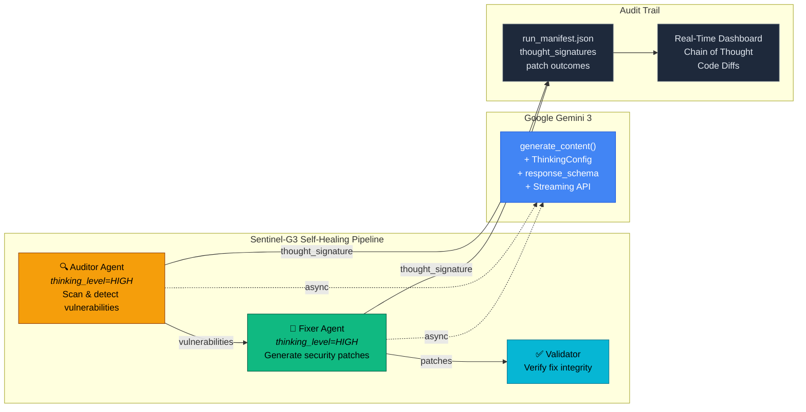

<p align="center">
  
  
  
  
</p>

<h1 align="center">Sentinel-G3</h1>
<p align="center"><strong>Autonomous Self-Healing Security Auditor</strong></p>
<p align="center">
  <em>An AI that doesn't just find vulnerabilities — it <b>reasons</b> through them, <b>fixes</b> them,<br/>
  and <b>proves</b> every decision with a cryptographically signed chain of thought.</em>
</p>
<p align="center">
  Built for the <a href="https://gemini3.devpost.com/">Gemini 3 Hackathon</a> &middot; Powered by <a href="https://deepmind.google/technologies/gemini/">Google Gemini 3</a> (Flash/Pro) + <code>google-genai</code> SDK
</p>

---

## Proof of Reasoning

> When a judge clicks on any vulnerability, they see exactly what the AI was thinking — not a black box, but a glass box.

<!-- Replace with actual screenshot after a successful run -->
<!--  -->

| Auditor Reasoning | Fixer Reasoning |
|---|---|
| *"I noticed a string interpolation in a SQL query on line 18. This is a classic injection point because user input flows directly into `f"SELECT ... WHERE name = '{username}'"` without sanitisation..."* | *"To fix this, I am implementing parameterized queries using the sqlite3 driver's `?` placeholder syntax. This ensures input is treated as data, never as SQL..."* |

The full chain-of-thought from both agents is captured with Gemini 3's `thought_signature` — a cryptographic proof that this reasoning actually happened inside the model, not fabricated after the fact.

---

## 🎯 Gemini 3 Integration

Sentinel-G3 is **fundamentally built around Gemini 3's advanced reasoning capabilities**, making it impossible to replicate with traditional LLMs or static analysis tools. The integration leverages five core Gemini 3 features that are central to the application's autonomous security auditing and self-healing workflow.

**1. High-Level Reasoning (`thinking_level="HIGH"`)** — Both the Auditor and Fixer agents use `ThinkingConfig(thinking_level="HIGH")` to enable deep, multi-step reasoning. This allows the Auditor to understand context-dependent vulnerabilities (like logic flaws, privilege escalation) that require genuine comprehension, not pattern matching. The Fixer uses the same deep reasoning to generate contextually appropriate patches that preserve functionality while eliminating security risks.

**2. Chain-of-Thought Streaming (`include_thoughts=True` + `generate_content_stream`)** — The Fixer agent uses Gemini's streaming API with `include_thoughts=True` to emit thinking chunks in real-time. This enables the dashboard to display the agent's reasoning process **live** as it generates fixes, creating transparency and trust. Users see exactly how the AI analyzes the vulnerability, considers attack vectors, and selects the remediation strategy—all streamed via Server-Sent Events to the frontend.

**3. Cryptographic Thought Signatures (`thought_signature`)** — Every reasoning step from both agents includes a `thought_signature`—a cryptographic proof that the reasoning actually occurred inside the model. These signatures are extracted, base64-encoded, and stored in `run_manifest.json`, providing an immutable audit trail. This feature is **central** to Sentinel-G3's "proof of reasoning" value proposition, enabling verification that fixes weren't fabricated post-hoc.

**4. Structured Output (`response_schema`)** — The Auditor uses `response_schema=list[Vulnerability]` with `response_mime_type="application/json"` to receive perfectly typed Pydantic models directly from Gemini. This eliminates parsing errors, ensures type safety, and enables the orchestrator to process findings without manual JSON validation.

**5. Model Fallback & Async Operations** — The system uses `google-genai`'s async client (`client.aio.models`) for non-blocking operations and implements intelligent fallback from `gemini-3-flash-preview` to `gemini-3-pro-preview` on quota exhaustion, ensuring reliability under high demand.

Without Gemini 3's reasoning depth, streaming thoughts, and cryptographic signatures, Sentinel-G3 would be just another vulnerability scanner. These features enable the **autonomous, verifiable, transparent** security remediation that defines the project.

---

## Why Sentinel-G3?

Most security scanners hand you a list of problems and walk away. Sentinel-G3 **closes the loop**:

1. **Finds** vulnerabilities using Gemini 3 with `thinking_level=HIGH` — deep reasoning, not regex
2. **Fixes** them autonomously — generating syntax-safe patches with backup safety nets
3. **Proves** every decision — signed audit trail with full chain-of-thought transparency

This is not a wrapper around an LLM. It's an **agentic system** where specialised AI agents collaborate, reason through edge cases, and produce verifiable output.

---

## Architecture



### How the Agents Use Gemini 3

**Auditor Agent** (`app/agents/auditor.py`)
```python
response = await client.aio.models.generate_content(
    model=self.active_model,  # gemini-3-flash-preview (primary) or gemini-3-pro-preview (fallback)
    contents=prompt,
    config=types.GenerateContentConfig(
        system_instruction="You are an elite security researcher...",
        thinking_config=types.ThinkingConfig(
            thinking_level="HIGH",
            include_thoughts=True,  # Capture chain-of-thought
        ),
        response_mime_type="application/json",
        response_schema=list[Vulnerability],  # Structured output
    ),
)
```

**Fixer Agent** (`app/agents/fixer.py`) — with real-time streaming
```python
# Uses streaming API for live chain-of-thought
stream = await client.aio.models.generate_content_stream(
    model=self.active_model,
    contents=prompt,
    config=types.GenerateContentConfig(
        system_instruction="You are a Senior Security Engineer...",
        thinking_config=types.ThinkingConfig(
            thinking_level="HIGH",
            include_thoughts=True,  # Stream thinking chunks
        ),
    ),
)
async for chunk in stream:
    if chunk.part.thought:
        await on_thinking(chunk.part.text)  # Emit to dashboard in real-time
```

**Orchestrator** (`app/orchestrator.py`) — captures the thought signatures:
```python
for part in response.candidates[0].content.parts:
    if part.thought and part.thought_signature:
        # Cryptographic proof of reasoning
        base64.b64encode(part.thought_signature)
```

---

## Prerequisites

| Requirement | Version | Why |
|---|---|---|
| **Python** | 3.12+ | Required for modern type syntax (`X \| Y`, generics) |
| **Node.js** | 18+ | Required for the Next.js 15 dashboard |
| **Gemini API Key** | — | Get one free at [aistudio.google.com/apikey](https://aistudio.google.com/apikey) |
| **`google-genai` SDK** | >=1.51.0 | The official Python SDK for Gemini 3 — includes `ThinkingConfig`, `thought_signature`, async support |

> **Important:** This project uses `google-genai` (the new unified SDK), **not** the older `google-generativeai` package. Make sure you install the right one.

---

## Getting Started

### 1. Clone & Install

```bash
git clone https://github.com/shreyas-debug/SentinelG3.git
cd SentinelG3

# Create virtual environment
python -m venv .venv
.venv\Scripts\activate        # Windows
# source .venv/bin/activate   # macOS / Linux

# Install Python dependencies (includes google-genai with aiohttp)
pip install -r requirements.txt
```

### 2. Configure Your API Key

```bash
copy .env.template .env       # Windows
# cp .env.template .env       # macOS / Linux
```

Open `.env` and add your Gemini API key:
```
GEMINI_API_KEY=your-key-from-aistudio
```

### 3. Start the Backend

```bash
uvicorn app.main:app --host 127.0.0.1 --port 8000
```

The API will be live at **http://127.0.0.1:8000** (interactive docs at `/docs`).

### 4. Start the Dashboard

```bash
cd dashboard
npm install
npm run dev
```

Open **http://localhost:3000**. You can scan either:
- **Local directory**: Enter a path (e.g. `test_lab/`)
- **GitHub repository**: Paste a repo URL (e.g. `https://github.com/user/repo`) and optionally provide a GitHub token to create a Pull Request with fixes

Then hit **Run Security Scan**.

### 5. Run the Integration Test

```bash
python scripts/run_integration_test.py
```

This runs the full pipeline against the **Vulnerability Lab** and prints a Hackathon Readiness Report.

---

## Vulnerability Lab (`test_lab/`)

We built a controlled test environment with **13 deliberately planted vulnerabilities** across three categories. This gives the agents a predictable, reproducible playground that judges can verify.

| File | Vulnerability Type | Count | What it Tests |
|---|---|---|---|
| `sql_lab.py` | SQL Injection | 3 | f-string interpolation, string concatenation, `.format()` — Fixer must produce parameterized queries |
| `secret_lab.js` | Hardcoded Secrets | 5 | API keys, DB passwords, JWT secrets, AWS credentials — Auditor must catch all, Fixer must replace with `process.env` |
| `logic_lab.py` | Broken Auth & Logic Flaws | 5 | `or` vs `and` bug, privilege escalation, timing attack, session fixation, missing rate limit — requires **genuine reasoning**, not pattern matching |

Pristine originals are preserved in `test_lab_golden/` and auto-restored before each test run.

---

## Real-Time Dashboard

The Next.js 15 dashboard connects to the backend via **Server-Sent Events** for live streaming:

- **Live Feed** — terminal-style log output as the orchestrator progresses
- **Healing History** — expandable table with severity badges and status
- **Chain of Thought** — side-by-side Auditor and Fixer reasoning panels
- **Code Diff** — Shiki syntax-highlighted side-by-side comparison (original vs. healed)
- **Thinking Animation** — pulsing progress bars while Gemini reasons
- **Dark "War Room" Aesthetic** — emerald for healed, amber for threats, red for critical

---

## Integration Test & Readiness Report

`scripts/run_integration_test.py` provides automated end-to-end validation:

| Phase | What it checks |
|---|---|
| **Phase 1** — Cleanup | Removes old manifests, backups; restores golden copies |
| **Phase 2** — Execute | Runs `SentinelOrchestrator.run_self_healing_cycle()` against `test_lab/` |
| **Phase 3a** — Mutation | Verifies files in `test_lab/` actually changed |
| **Phase 3b** — Backups | Confirms `.bak` files exist for every modified file |
| **Phase 3c** — Manifest | Validates `run_manifest.json` structure and `thought_signature` entries |
| **Phase 3d** — Reasoning Quality | **CoT Density** (reasoning depth), **Signature Integrity** (base64 validation), **Heal Efficiency** (syntax-safe patches) |
| **Phase 4** — Verdict | Composite score, per-vulnerability breakdown, ASCII art verdict |

---

## Project Structure

```
SentinelG3/
├── app/
│   ├── main.py                 # FastAPI entry-point (CORS, health check)
│   ├── config.py               # Gemini API key + settings from .env
│   ├── orchestrator.py         # SentinelOrchestrator — pipeline coordinator
│   ├── agents/
│   │   ├── base.py             # Abstract BaseAgent (Gemini client init)
│   │   ├── auditor.py          # Stage 1 — thinking_level=HIGH vulnerability scan
│   │   ├── fixer.py            # Stage 2 — thinking_level=HIGH patch generation
│   │   └── validator.py        # Stage 3 — fix verification (extensible)
│   ├── api/
│   │   └── routes.py           # SSE /scan endpoint + /history
│   └── models/
│       └── schemas.py          # Pydantic v2 models (Vulnerability, PatchResult, etc.)
│
├── dashboard/                  # Next.js 15 + React 19 + Tailwind CSS v4
│   └── src/
│       ├── app/                # Layout, page, dark-mode globals
│       ├── components/         # ScanButton, LiveFeed, HealingHistory, CodeDiff, etc.
│       └── lib/                # SSE client, data types, utilities
│
├── test_lab/                   # Vulnerability Lab — 13 planted security flaws
├── test_lab_golden/            # Pristine copies (auto-restored before tests)
├── scripts/
│   └── run_integration_test.py # Full pipeline test + Hackathon Readiness Report
│
├── requirements.txt            # pip install -r requirements.txt
├── .env.template               # Copy to .env, add GEMINI_API_KEY
└── .gitignore                  # .env, *.bak.*, run_manifest.json excluded
```

---

## API Endpoints

| Method | Path | Description |
|---|---|---|
| `POST` | `/api/v1/scan` | Start a scan — returns SSE stream (`log`, `vuln`, `patch`, `summary` events) |
| `GET` | `/api/v1/history` | Retrieve the latest `run_manifest.json` |
| `GET` | `/health` | Service health check |

---

## Tech Stack

| Layer | Technology |
|---|---|
| **LLM** | Google Gemini 3 Flash/Pro via [`google-genai`](https://pypi.org/project/google-genai/) SDK — `thinking_level=HIGH`, `include_thoughts=True`, `response_schema`, `thought_signature`, streaming API |
| **Backend** | Python 3.12+, FastAPI, Uvicorn, Server-Sent Events |
| **Frontend** | Next.js 15, React 19, TypeScript, Tailwind CSS v4, Shiki syntax highlighting |
| **UI** | Shadcn/UI patterns, Lucide icons, custom dark-mode war-room theme |
| **Data** | Pydantic v2 for all agent I/O, JSON manifest for audit trail |

---

## 🏆 Hackathon Submission

### Public Repository
**GitHub:** [https://github.com/shreyas-debug/SentinelG3](https://github.com/shreyas-debug/SentinelG3)

The repository is **public** and contains the complete source code, including:
- FastAPI backend with Auditor and Fixer agents
- Next.js 15 dashboard with real-time streaming UI
- Vulnerability Lab (`test_lab/`) with 13 planted vulnerabilities
- Integration test suite with Hackathon Readiness Report
- Full documentation and setup instructions

### Public Project Access

**Local Setup Required:** Sentinel-G3 requires a local installation to run (backend + frontend). To experience the project:

1. **Clone the repository** (see [Getting Started](#getting-started) above)
2. **Get a free Gemini API key** from [aistudio.google.com/apikey](https://aistudio.google.com/apikey)
3. **Follow the setup instructions** to run the backend and dashboard locally

### Key Features Demonstrated

- ✅ **Autonomous Security Auditing** — Finds vulnerabilities using deep reasoning
- ✅ **Self-Healing** — Generates and applies security patches automatically
- ✅ **Real-Time Chain-of-Thought** — Streams AI reasoning live to the dashboard
- ✅ **Cryptographic Proof** — Thought signatures provide verifiable audit trail
- ✅ **GitHub Integration** — Can scan GitHub repositories, apply patches, and automatically create Pull Requests with fixes
- ✅ **Transparent Decision-Making** — Every fix includes full reasoning and code diffs

---

